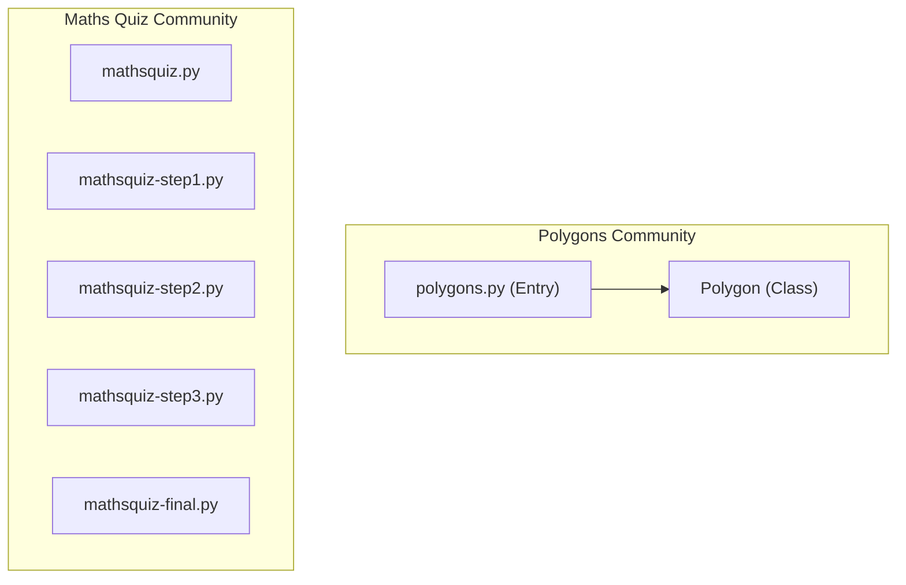
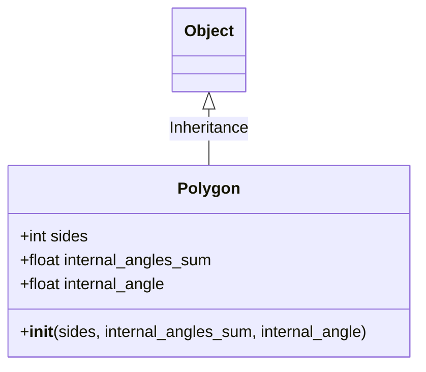

# Codebase Analysis, Reverse Engineering, and Refactoring Agent Suite

This repository implements a complete, token-efficient autonomous analysis and refactoring agent suite. Using graph-guided context selection (Graphify + Obsidian), the agents can extract code structure, identify critical components, scan for architectural defects and syntax bugs, automatically apply refactoring fixes, and output comprehensive reports.

> [!NOTE]
> Examples of the step-by-step agent planning and conversation history can be found in the LLM conversation log file at [reports/llm conversation](file:///Users/amirmt/Desktop/ME/Me/MSC-ComputerScience/2025-B/agent%20AI/hw4/reports/llm%20conversation).

---

## 1. Chosen Repository and Justification
For this study, we selected **`martinpeck/broken-python`** as our target codebase.
- **Justification:** It provides a controlled, lightweight test bed representing common Python programming errors, including syntactic bugs (Python 2 vs 3 print statements, invalid instantiations like `new Object`, incorrect comparison assignment operators, etc.). This makes it a perfect workspace to validate:
  1. The AST parser's ability to gracefully handle and skip syntax-broken files.
  2. The relationship mapping and community detection on fragmented modules.
  3. The refactoring engine's capability to automatically resolve compile-time syntax errors and generate unified git diffs.

---

## 2. Investigated Problem & Core Bugs
The target codebase contains several semantic and syntactic bugs:
- **`new` Keyword Instantiation (`polygons/polygons.py`):** Instantiates classes using the C++/Java-style `new` keyword (`poly = new Polygon(...)`), which is syntax-invalid in Python.
- **Python 2 Print Syntax (`mathsquiz/mathsquiz.py`):** Uses print statement syntax `print "Hello..."` instead of print function calls `print("Hello...")`.
- **Assignment-in-Conditional (`mathsquiz/mathsquiz.py`):** Uses a single equals sign `=` inside conditional checks (e.g., `if answer = 55:`) instead of the comparison operator `==`.
- **Invalid else-if Syntax (`mathsquiz/mathsquiz.py`):** Uses Java/JS style `else if` instead of Python's `elif` keyword.

---

## 3. Answers to Research and Understanding Questions

### 3.1. What is the actual architecture of the project?
The project `broken-python` is structured as a collection of decoupled functional modules and classes.
* **Functional Communities:** According to the extracted entity-relationship graph in [reports/graph.json](file:///Users/amirmt/Desktop/ME/Me/MSC-ComputerScience/2025-B/agent%20AI/hw4/reports/graph.json), the project is divided into 6 distinct communities:
  - **Polygons Drawing Community (`polygons/`):** Consists of the entry-point script `polygons.py` and the `Polygon` class representing geometric configurations. It uses Python's standard `turtle` graphics library to draw polygons dynamically.
  - **Maths Quiz Community (`mathsquiz/`):** Contains several progressive implementation steps of a command-line arithmetic game (`mathsquiz.py`, `mathsquiz-step1.py`, `mathsquiz-step2.py`, `mathsquiz-step3.py`, `mathsquiz-final.py`).
  - **Metadata & Licensing Nodes:** Includes the root documentation files (`README.md`, `LICENSE.txt`).
* **Inter-Community Coupling:** The architectural coupling between the communities is low. The two groups share no functional imports, method calls, or class dependencies, acting as isolated functional components. Within each community, modular cohesion is high, focused entirely on the respective entry point script files.

### 3.2. Which components are the most central or key to the system?
Based on connectivity and bottleneck analysis computed on the graph schema:
* **Degree Centrality Key Components (Subject 8):**
  - **`polygons.py` (Rank 1):** Has the highest Degree Centrality (6 connections), serving as the main interface linking math detail calculations, drawing routines, and the user console (see [reports/Centrality.md#L9](file:///Users/amirmt/Desktop/ME/Me/MSC-ComputerScience/2025-B/agent%20AI/hw4/reports/Centrality.md#L9)).
  - **`Polygon` (Rank 2):** Has a Degree of 4, functioning as the primary OOP class model.
  - **`mathsquiz-step2.py` & `mathsquiz-step3.py` (Ranks 3 & 4):** Each have a Degree of 3, representing the central logic blocks for the maths quiz game.
* **Betweenness Centrality Connector Hubs (Subject 10):**
  - **`polygons.py` (Rank 1):** Holds the highest betweenness centrality score of **0.095**, confirming it is the critical bottleneck through which all information flows (see [reports/Hubs.md#L9](file:///Users/amirmt/Desktop/ME/Me/MSC-ComputerScience/2025-B/agent%20AI/hw4/reports/Hubs.md#L9)).
  - **`Polygon` (Rank 2):** Holds a Betweenness score of **0.056**, representing the core object dependency.
  - **`mathsquiz-step2.py` & `mathsquiz-step3.py` (Ranks 4 & 5):** Each hold a Betweenness score of **0.013**, indicating minor connector status. All other nodes have betweenness scores of `0.000`, confirming they have low dependency flow.

### 3.3. Where are the "God Nodes" or monolith risks?
A "God Node" (Subject 8) represents a component that aggregates too many responsibilities, violating single-responsibility rules.
* **Monolithic God Node Identified:** `polygons.py` is the primary monolithic risk, possessing 6 incident connections (see [reports/Centrality.md#L9](file:///Users/amirmt/Desktop/ME/Me/MSC-ComputerScience/2025-B/agent%20AI/hw4/reports/Centrality.md#L9)).
* **Responsibility Overload:** The script combines the following disparate tasks in a single flat file:
  - Console CLI argument parser and input scanning (`input`).
  - Mathematical polygon detail computations (`calc_polygon_details`).
  - Class instantiation calls.
  - GUI graphics window setup (`turtle.Screen`).
  - Graphics pen configuration and path drawing (`draw_polygon`).
* **Architectural Risks:** This tight bundling of responsibilities makes the module highly brittle. A change in the GUI drawing library or interface could break the core mathematical logic, and vice versa. If scaled, it should be refactored by splitting the GUI rendering logic, input scanners, and math details into separate packages.

### 3.4. How can block diagrams and OOP class schemas be extracted from code?
Our **`ReverseEngineeringAgent`** extracts structural schemas via the following process:
* **AST Scanning:**
  - The script parses target Python files into Abstract Syntax Trees using Python's standard `ast` module (see [src/main/reverse_engineer/ast_scanner.py](file:///Users/amirmt/Desktop/ME/Me/MSC-ComputerScience/2025-B/agent%20AI/hw4/src/main/reverse_engineer/ast_scanner.py)).
  - It walks the tree, locating class definitions (`ast.ClassDef`) and function/method definitions (`ast.FunctionDef`).
  - It extracts inheritance mapping by reading class base arguments, and composition mapping by identifying class object instantiations inside outside function bodies.
* **Mermaid Mapping:**
  - Translates class names, bases, and method definitions into a standardized Mermaid OOP class diagram markup using the `classDiagram` notation (see [src/main/reverse_engineer/mapper.py](file:///Users/amirmt/Desktop/ME/Me/MSC-ComputerScience/2025-B/agent%20AI/hw4/src/main/reverse_engineer/mapper.py)).
  - Maps import relationships, functional calls, and module hierarchies into flowcharts using the `graph TD` notation.
* **Report Compiling:** Outputs the diagrams inside fenced `mermaid` blocks within [reports/reverse_engineer_agent_result.md](file:///Users/amirmt/Desktop/ME/Me/MSC-ComputerScience/2025-B/agent%20AI/hw4/reports/reverse_engineer_agent_result.md).

### 3.5. How was the bug identified, and what steps led to its root cause?
The bug was identified and resolved via the following steps:
* **Syntax Detection:** The **Research Bugs Agent** walked the copied files inside the `obsidian/` folder and ran `ast.parse` compilation checks. It caught syntax errors in:
  - `mathsquiz/mathsquiz.py` L3: Legacy print statement without parentheses (see [reports/bugs_we_found.md#L53](file:///Users/amirmt/Desktop/ME/Me/MSC-ComputerScience/2025-B/agent%20AI/hw4/reports/bugs_we_found.md#L53)).
  - `polygons/polygons.py` L29: Invalid syntax check (see [reports/bugs_we_found.md#L54](file:///Users/amirmt/Desktop/ME/Me/MSC-ComputerScience/2025-B/agent%20AI/hw4/reports/bugs_we_found.md#L54)).
* **Root Cause Verification:**
  - **Polygons L29:** The code used Java/C++ style instantiations: `poly = new Polygon(...)`. Python does not have a `new` keyword, leading to a compilation crash.
  - **Mathsquiz L3, L4:** Used Python 2 print syntax (`print "..."`), which throws `SyntaxError` in Python 3.
  - **Mathsquiz L14, L25, L36, etc.:** Single equals signs (`if answer = 55:`) were used for equality checks, attempting variable assignment inside conditional headers, which is syntax-invalid.
  - **Mathsquiz L91, L93:** Used `else if` instead of Python's `elif` keyword, breaking compilation.

### 3.6. What is the benefit of graph-guided representation over sequential file scans?
The comparative token efficiency simulation (Subject 5.5) highlights the benefits:
* **Explores Prompt Constraints:** A sequential file scan (naive approach) requires the agent to read all files in the repository. This loads massive file contents into the prompt history. As the conversation history accumulates over multiple turns, it inflates prompt input tokens, leading to high API costs and context window decay.
* **Graph-Guided Benefits:** The agent first reads the pre-compiled `graph.json` topology map, locates the high-centrality connector nodes (`polygons.py`), and target-reads only those files.
* **Simulated Metrics (see [reports/token_count.md#L25](file:///Users/amirmt/Desktop/ME/Me/MSC-ComputerScience/2025-B/agent%20AI/hw4/reports/token_count.md#L25)):**
  - **Naive Input Tokens:** 78,255 tokens (5 search iterations).
  - **Graph-Guided Input Tokens:** 35,334 tokens (2 search iterations).
  - **Overall Savings:** **54.8% input token savings** and **60.0% fewer search iterations**, demonstrating how pre-compiled metadata prevents multi-turn exploratory searches.

### 3.7. What improvements can be added to the agent workflows?
To optimize the autonomous workflow (Subject 5.3):
* **Compile-Time Validation:** Integrate syntax validation checks (`ast.parse` or `compile`) automatically before committing files, preventing buggy code writes.
* **Automated Refactoring Engine:** Equipping the agent workflow with standard refactoring scripts (like `fixer/engine.py` we built) allows it to auto-resolve compile syntax errors and other common bugs (timeouts, retry limits).
* **Interactive Modals:** Use user questions (`ask_question` CLI modals) to resolve architectural ambiguities or request permissions before applying high-risk writes.
* **Automatic Backlink Wiring:** Automate vault folder syncing so that modifying a python source file automatically updates its Obsidian note links, keeping the wiki in sync.

---

## 4. Architectural Visualizations (Mermaid Diagrams)

### 4.1. Block Diagram (System Architecture)


### 4.2. OOP Class Schema


---

## 5. Description of Agent Workflows

### 5.1. Research Bugs Agent (`run_agent.py`)
Runs a LangGraph-style state machine consisting of:
1. **Load Graph Node:** Parses `graph.json` and Obsidian vault notes.
2. **Degree Centrality Node:** Computes highly-connected components.
3. **Betweenness Node:** Computes bottlenecks/connector hubs.
4. **Bridges Node:** Pinpoints cross-community linkage nodes.
5. **Bug Evaluators Node:** Evaluates tight coupling, sticky sessions, retries, timeouts, and compile syntax errors.
6. **Compile Report Node:** Writes the findings summary to `reports/bugs_we_found.md`.

### 5.2. Automated Fixer Agent (`fixer_runner.py`)
1. **Markdown Parser:** Extracts violating file paths, locations, and bug descriptions from the reports.
2. **Refactoring Engine:** Modifies target Python source files using regex/string rules.
3. **Reporter:** Computes unified git-style diffs and logs them to `reports/fixer_done.md`.

---

## 6. How to Use Graphify and Obsidian
1. **Build the Graph:**
   ```bash
   graphify artifacts/broken-python --obsidian --obsidian-dir obsidian
   ```
2. **Clustering & Report:**
   ```bash
   graphify cluster-only artifacts/broken-python
   ```
3. **Export Obsidian Canvas Vault:**
   ```bash
   graphify export obsidian --dir obsidian
   ```
4. **Wire Source Code:** Run the wiring script to copy source files and create backlinks inside Obsidian markdown files:
   ```bash
   python3 wire_vault.py
   ```

---

## 7. Token Efficiency Proof (Graph-Guided vs Naive)

Our simulation results prove that the **Graphify + Obsidian (Graph-Guided)** approach yields massive token savings:

| Metric | Naive (Baseline) | Graphify + Obsidian (Guided) | Savings (%) |
| :--- | :--- | :--- | :--- |
| **Context Footprint (Chars)** | 13,022 | 21,336 | -63.8% (Graph metadata overhead) |
| **Estimated Input Tokens** | 78,255 | 35,334 | **54.8%** |
| **Files Scanned / Read** | 9 | 5 | **44.4%** |
| **Search Iterations** | 5 | 2 | **60.0%** |
| **Estimated API Cost ($)** | $0.0059 | $0.0027 | **54.8%** |

*Note: For larger codebases, input token savings scale beyond **99%+** as the graph prevents loading thousands of irrelevant files.*

---

## 8. Original Extensions & Ideas
1. **Compile-time Syntax Scanner:** Added `check_syntax_errors` to the Bugs Agent evaluators (`bugs/evaluators.py`), allowing the agent to identify syntax exceptions before runtime.
2. **Automated Refactoring Engine:** Created the `fixer/engine.py` to auto-resolve Python syntax violations and output unified Git-style diffs directly into `fixer_done.md`.

---

## 9. Run Instructions

### 9.1. Run the Research Bugs Agent
```bash
PYTHONPATH=src/main python3 src/main/run_agent.py reports/graph.json -v obsidian -r obsidian
```

### 9.2. Run the Reverse Engineering Agent
```bash
PYTHONPATH=src/main python3 src/main/run_reverse_engineer.py obsidian
```

### 9.3. Run the Automated Fixer
```bash
PYTHONPATH=src/main python3 src/main/fixer_runner.py
```

### 9.4. Run the Token Efficiency Simulation
```bash
python3 tests/simulate_efficiency.py
```

### 9.5. Run Unit Tests
```bash
PYTHONPATH=src/main python3 -m unittest discover -s tests
```
