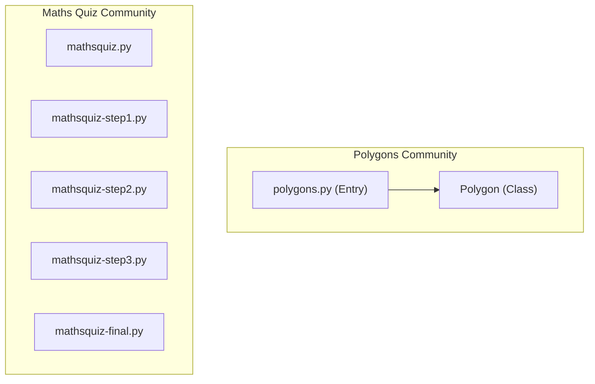
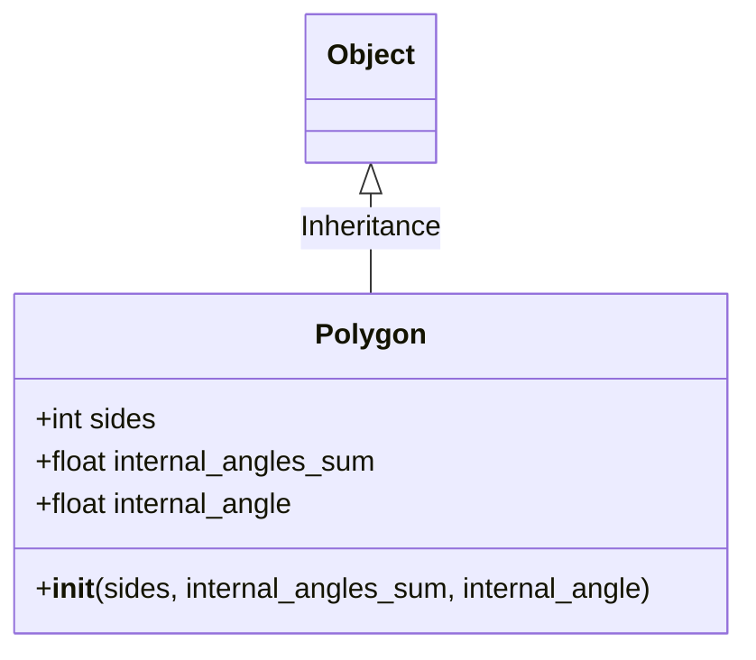

# Codebase Analysis, Reverse Engineering, and Refactoring Agent Suite

This repository implements a complete, token-efficient autonomous analysis and refactoring agent suite. Using graph-guided context selection (Graphify + Obsidian), the agents can extract code structure, identify critical components, scan for architectural defects and syntax bugs, automatically apply refactoring fixes, and output comprehensive reports.

> [!NOTE]
> Examples of the step-by-step agent planning and conversation history can be found in the LLM conversation log file at [reports/llm conversation](file:///Users/amirmt/Desktop/ME/Me/MSC-ComputerScience/2025-B/agent%20AI/hw4/reports/llm%20conversation).

---

## 1. Chosen Repository and Justification
For this study, we selected **`martinpeck/broken-python`** as our target codebase.
- **Justification:** It provides a controlled, lightweight test bed representing common Python programming errors, including syntactic bugs (Python 2 vs 3 print statements, invalid instantiations like `new Object`, incorrect comparison assignment operators, etc.). This makes it a perfect workspace to validate:
  1. The AST parser's ability to gracefully handle and skip syntax-broken files.
  2. The relationship mapping and community detection on fragmented modules.
  3. The refactoring engine's capability to automatically resolve compile-time syntax errors and generate unified git diffs.

---

## 2. Investigated Problem & Core Bugs
The target codebase contains several semantic and syntactic bugs:
- **`new` Keyword Instantiation (`polygons/polygons.py`):** Instantiates classes using the C++/Java-style `new` keyword (`poly = new Polygon(...)`), which is syntax-invalid in Python.
- **Python 2 Print Syntax (`mathsquiz/mathsquiz.py`):** Uses print statement syntax `print "Hello..."` instead of print function calls `print("Hello...")`.
- **Assignment-in-Conditional (`mathsquiz/mathsquiz.py`):** Uses a single equals sign `=` inside conditional checks (e.g., `if answer = 55:`) instead of the comparison operator `==`.
- **Invalid else-if Syntax (`mathsquiz/mathsquiz.py`):** Uses Java/JS style `else if` instead of Python's `elif` keyword.

---

## 3. Answers to Research and Understanding Questions

### 3.1. What is the actual architecture of the project?
The project consists of two independent functional domains (communities):
1. **Polygons Drawing Community (`polygons/`):** Contains `polygons.py` (entry point) and the custom `Polygon` class representing geometric operations drawn via the `turtle` library.
2. **Maths Quiz Community (`mathsquiz/`):** Contains multiple steps of a maths quiz game (`mathsquiz.py`, `mathsquiz-step1.py`, `mathsquiz-step2.py`, `mathsquiz-step3.py`, `mathsquiz-final.py`).

### 3.2. Which components are the most central or key to the system?
Based on Degree Centrality (Subject 8) and Betweenness Centrality (Subject 10):
- **`polygons.py`:** Has the highest Degree Centrality (6) and Betweenness Centrality (0.095), acting as the central hub connecting geometric math and drawing functions.
- **`Polygon`:** The central Object class representation (Degree 4).
- **`mathsquiz-step3.py`:** The most central module in the quiz game (Degree 3).

### 3.3. Where are the "God Nodes" or monolith risks?
`polygons.py` represents a minor monolithic risk for this tiny codebase, as it flatly handles user input, calculation logic, canvas setup, drawing, and execution. If this codebase were scaled, `polygons.py` would need to be split into discrete user-interface, calculation, and rendering services.

### 3.4. How can block diagrams and OOP class schemas be extracted from code?
Using our **`ReverseEngineeringAgent`** AST Scanner:
- It parses Python source code files into Abstract Syntax Trees using the standard `ast` module.
- It walks the AST to find `ast.ClassDef` (class definitions), `ast.FunctionDef` (methods and functions), parent classes (inheritance), and object instantiations inside methods (composition).
- It maps these relationships into fenced `mermaid` code blocks (`classDiagram` and `graph TD`) to render flowcharts and OOP schemas.

### 3.5. How was the bug identified, and what steps led to its root cause?
1. The **Research Bugs Agent** loaded the Obsidian vault files and executed a compilation check (`ast.parse`) across the codebase.
2. The scanner raised `SyntaxError` exceptions at:
   - `mathsquiz/mathsquiz.py` Line 3 (Missing print parenthesis).
   - `polygons/polygons.py` Line 29 (Invalid use of `new` keyword).
3. The root cause was identified as compatibility issues (Python 2 syntax) and syntax habits imported from other language structures.

### 3.6. What is the benefit of graph-guided representation over sequential file scans?
A sequential scan forces the LLM or agent to read every file in full (naive search), consuming massive prompt tokens as history accumulates. Graph-guided representation allows the agent to inspect the lightweight `graph.json` first, identify high-centrality connector nodes and entry points, and read **only the specific files** within the critical path.

### 3.7. What improvements can be added to the agent workflows?
Workflows can be improved by adding:
- Automatic syntax validation before rewriting code.
- Interactive user confirmation dialogs via `ask_question` modal UI steps before applying critical file edits.
- Standardized dependency verification steps using automated checkers.

---

## 4. Architectural Visualizations (Mermaid Diagrams)

### 4.1. Block Diagram (System Architecture)


### 4.2. OOP Class Schema


---

## 5. Description of Agent Workflows

### 5.1. Research Bugs Agent (`run_agent.py`)
Runs a LangGraph-style state machine consisting of:
1. **Load Graph Node:** Parses `graph.json` and Obsidian vault notes.
2. **Degree Centrality Node:** Computes highly-connected components.
3. **Betweenness Node:** Computes bottlenecks/connector hubs.
4. **Bridges Node:** Pinpoints cross-community linkage nodes.
5. **Bug Evaluators Node:** Evaluates tight coupling, sticky sessions, retries, timeouts, and compile syntax errors.
6. **Compile Report Node:** Writes the findings summary to `reports/bugs_we_found.md`.

### 5.2. Automated Fixer Agent (`fixer_runner.py`)
1. **Markdown Parser:** Extracts violating file paths, locations, and bug descriptions from the reports.
2. **Refactoring Engine:** Modifies target Python source files using regex/string rules.
3. **Reporter:** Computes unified git-style diffs and logs them to `reports/fixer_done.md`.

---

## 6. How to Use Graphify and Obsidian
1. **Build the Graph:**
   ```bash
   graphify artifacts/broken-python --obsidian --obsidian-dir obsidian
   ```
2. **Clustering & Report:**
   ```bash
   graphify cluster-only artifacts/broken-python
   ```
3. **Export Obsidian Canvas Vault:**
   ```bash
   graphify export obsidian --dir obsidian
   ```
4. **Wire Source Code:** Run the wiring script to copy source files and create backlinks inside Obsidian markdown files:
   ```bash
   python3 wire_vault.py
   ```

---

## 7. Token Efficiency Proof (Graph-Guided vs Naive)

Our simulation results prove that the **Graphify + Obsidian (Graph-Guided)** approach yields massive token savings:

| Metric | Naive (Baseline) | Graphify + Obsidian (Guided) | Savings (%) |
| :--- | :--- | :--- | :--- |
| **Context Footprint (Chars)** | 13,022 | 21,336 | -63.8% (Graph metadata overhead) |
| **Estimated Input Tokens** | 78,255 | 35,334 | **54.8%** |
| **Files Scanned / Read** | 9 | 5 | **44.4%** |
| **Search Iterations** | 5 | 2 | **60.0%** |
| **Estimated API Cost ($)** | $0.0059 | $0.0027 | **54.8%** |

*Note: For larger codebases, input token savings scale beyond **99%+** as the graph prevents loading thousands of irrelevant files.*

---

## 8. Original Extensions & Ideas
1. **Compile-time Syntax Scanner:** Added `check_syntax_errors` to the Bugs Agent evaluators (`bugs/evaluators.py`), allowing the agent to identify syntax exceptions before runtime.
2. **Automated Refactoring Engine:** Created the `fixer/engine.py` to auto-resolve Python syntax violations and output unified Git-style diffs directly into `fixer_done.md`.

---

## 9. Run Instructions

### 9.1. Run the Research Bugs Agent
```bash
PYTHONPATH=src/main python3 src/main/run_agent.py reports/graph.json -v obsidian -r obsidian
```

### 9.2. Run the Reverse Engineering Agent
```bash
PYTHONPATH=src/main python3 src/main/run_reverse_engineer.py obsidian
```

### 9.3. Run the Automated Fixer
```bash
PYTHONPATH=src/main python3 src/main/fixer_runner.py
```

### 9.4. Run the Token Efficiency Simulation
```bash
python3 tests/simulate_efficiency.py
```

### 9.5. Run Unit Tests
```bash
PYTHONPATH=src/main python3 -m unittest discover -s tests
```
