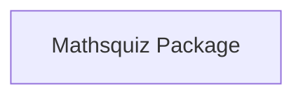

This file was written by the Agent.

# Codebase Reverse Engineering Report

This report contains structural and object-oriented analysis of the software codebase, generated autonomously by the `ReverseEngineeringAgent`.

## 1. Architectural Block Diagram
The following diagram illustrates the information and dependency flow between the top-level modules in the codebase:



### Block Explanation
The system is organized into decoupled subpackages, each handling distinct analysis concerns:
- **Mathsquiz**: The **Mathsquiz Package** is a functional sub-module in the application codebase.

## 2. Object-Oriented (OOP) Class Schema
The following class diagram defines class interfaces, inheritance lines, and composition boundaries detected in the codebase:

```mermaid
classDiagram
```

### Class Relationships and Explanations
No class definitions found in the scanned codebase.
