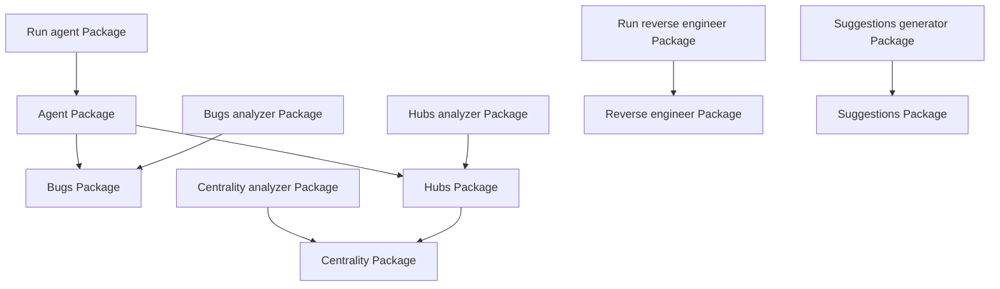
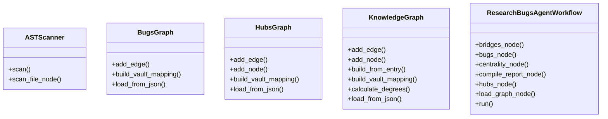

This file was written by the Agent.

# Codebase Reverse Engineering Report

This report contains structural and object-oriented analysis of the software codebase, generated autonomously by the `ReverseEngineeringAgent`.

## 1. Architectural Block Diagram
The following diagram illustrates the information and dependency flow between the top-level modules in the codebase:

### Block Explanation
The system is organized into decoupled subpackages, each handling distinct analysis concerns:
- **Agent**: The **Agent Package** orchestrates the complete analysis pipeline using a LangGraph-style State/Node state machine.
- **Bugs**: The **Bugs Package** scans configuration patterns and source file definitions to flag five critical architectural bugs/anti-patterns.
- **Bugs analyzer**: The **Bugs_analyzer Package** is a functional sub-module in the application codebase.
- **Centrality**: The **Centrality Package** parses graph linkages and computes Degree Centrality, flagging highly coupled 'God Node' candidates.
- **Centrality analyzer**: The **Centrality_analyzer Package** is a functional sub-module in the application codebase.
- **Hubs**: The **Hubs Package** implements Brandes' algorithm to compute Betweenness Centrality, identifying bottleneck nodes through which major architectural dependencies pass.
- **Hubs analyzer**: The **Hubs_analyzer Package** is a functional sub-module in the application codebase.
- **Reverse engineer**: The **Reverse Engineer Package** walks Abstract Syntax Trees (AST) to generate architectural and class diagrams.
- **Run agent**: The **Run_agent Package** is a functional sub-module in the application codebase.
- **Run reverse engineer**: The **Run_reverse_engineer Package** is a functional sub-module in the application codebase.
- **Suggestions**: The **Suggestions Package** maps discovered bugs to the 10 Solution Architecture Principles, formulating concrete refactoring recommendations.
- **Suggestions generator**: The **Suggestions_generator Package** is a functional sub-module in the application codebase.

## 2. Object-Oriented (OOP) Class Schema
The following class diagram defines class interfaces, inheritance lines, and composition boundaries detected in the codebase:

### Class Relationships and Explanations
#### Class: `ASTScanner`
- **Module**: `reverse_engineer.ast_scanner`
- **Inherits From**: None (Base class)
- **Composes**: None
- **Methods**: `scan()`, `scan_file_node()`

#### Class: `BugsGraph`
- **Module**: `bugs.graph_loader`
- **Inherits From**: None (Base class)
- **Composes**: None
- **Methods**: `add_edge()`, `build_vault_mapping()`, `load_from_json()`

#### Class: `HubsGraph`
- **Module**: `hubs.graph`
- **Inherits From**: None (Base class)
- **Composes**: None
- **Methods**: `add_node()`, `add_edge()`, `build_vault_mapping()`, `load_from_json()`

#### Class: `KnowledgeGraph`
- **Module**: `centrality.graph`
- **Inherits From**: None (Base class)
- **Composes**: None
- **Methods**: `add_node()`, `add_edge()`, `build_from_entry()`, `build_vault_mapping()`, `load_from_json()`, `calculate_degrees()`

#### Class: `ResearchBugsAgentWorkflow`
- **Module**: `agent.workflow`
- **Inherits From**: None (Base class)
- **Composes**: None
- **Methods**: `run()`, `load_graph_node()`, `centrality_node()`, `hubs_node()`, `bridges_node()`, `bugs_node()`, `compile_report_node()`

